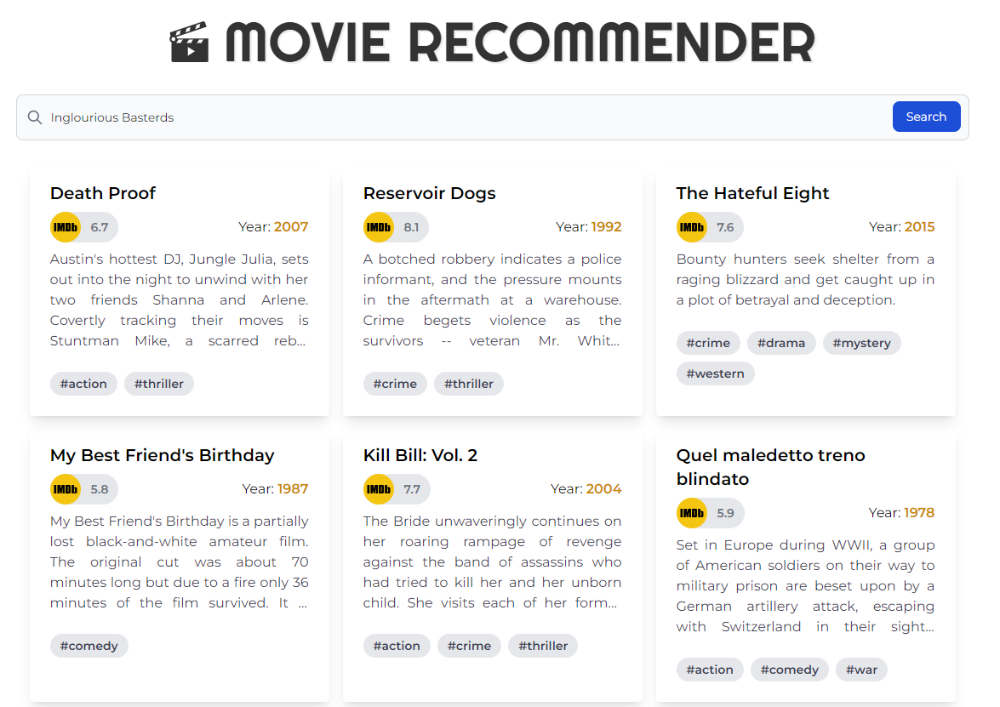

# :movie_camera: Movie Recommender 

Site: http://movie-recommender-v2.herokuapp.com/

This project is a content-based movie recommendation system. Given a movie title that a user likes it returns 10 similar movies that the user might like. The similarity between movies is based on three main features:

- Genres
- Casting (Including director and 5 main actors)
- Plot 

The previous features were encoded to vector representations. For *Genre* and *Casting* a simple word frequency count is used as they contain few uncorrelated text. For the *Plot* pre-trained [GloVe](https://link-url-here.org) word embedding is applied to map word to dense vectors. Finally, cosine similarity is used to define the similitude between two features. The final scoring metric is a weighted average of the three similarities:


## 1. Dataset
Available in: `src/movies_filtered.csv`

- **10K** movies 
- **Original languages**: English, Spanish, French, Italian and German.
- **Release year**: >= 1970
- **IMDB vote**: >= 4.0

## 2. Usage

1- :airplane: Visit the experimental web app: http://movie-recommender-v2.herokuapp.com/

Example:



2- :rocket: From the terminal. 

Example:
`python src/get_recommendations.py "Inglourious Basterds"`

```
If you like Inglourious Basterds you should see: 

Death Proof
Reservoir Dogs
The Hateful Eight
My Best Friend's Birthday
Kill Bill: Vol. 2
Quel maledetto treno blindato
Django Unchained
Pulp Fiction
Kill Bill: Vol. 1
Schutzengel
```


